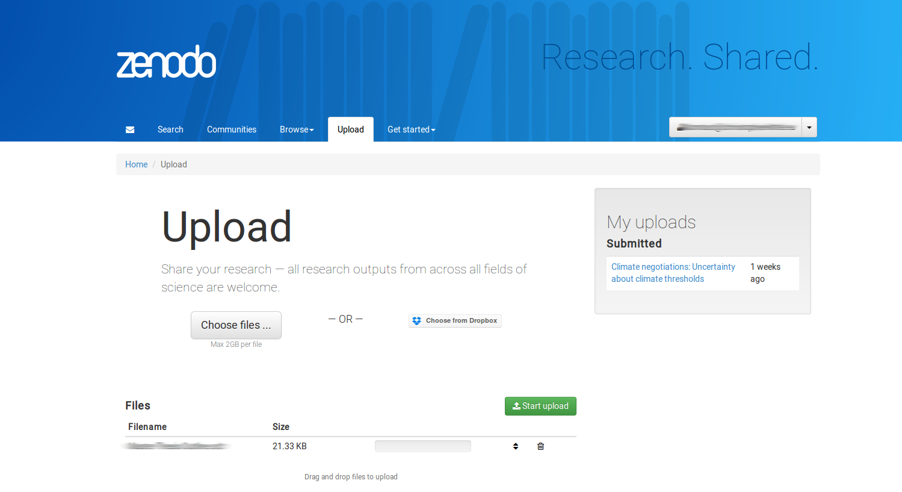
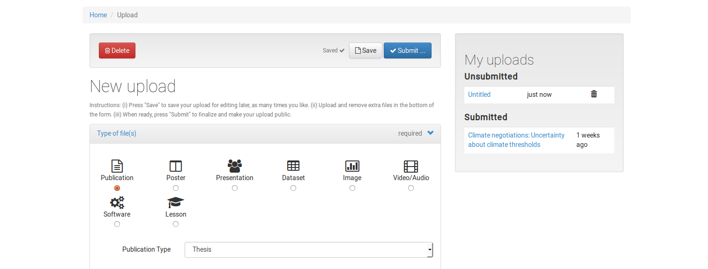
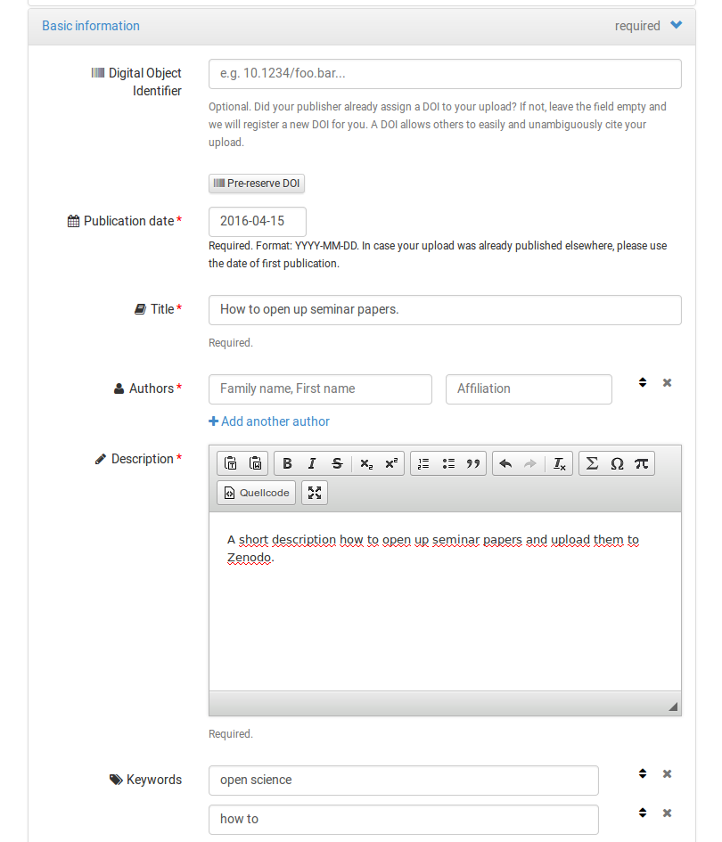
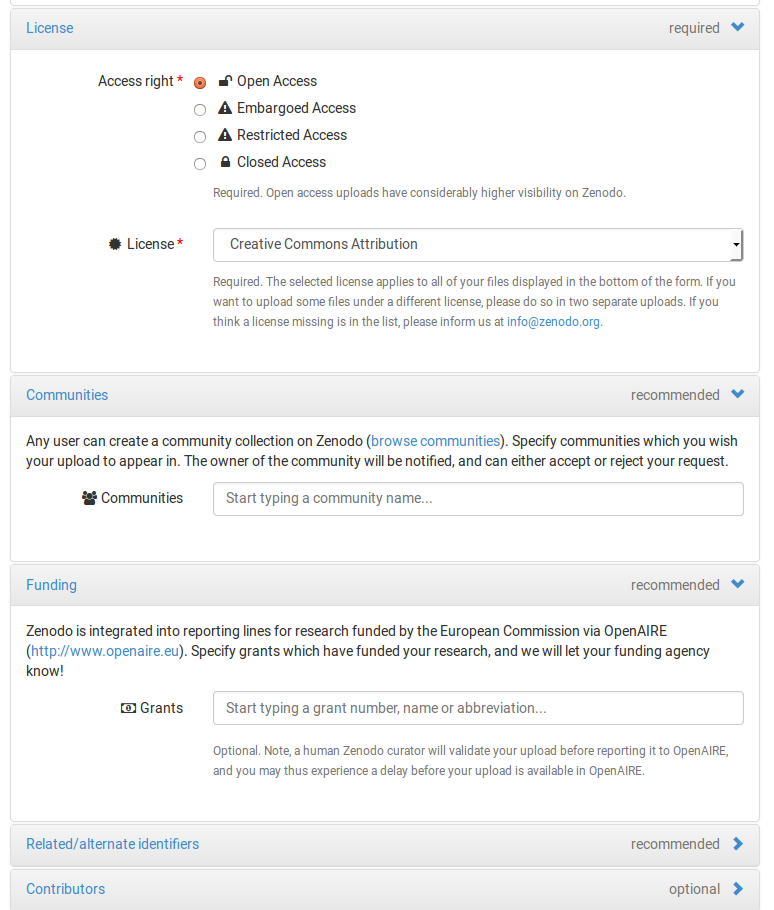

Tag der Befreiung der verlorenen Seminararbeiten
==============================
**Die natürliche Umgegung von Wissen ist die freie Wildbahn, und genau dorthin wollen wir gemeinsam wissenschaftliche Werke hin entlassen.**

In dem Workshop werden wir verlorene Seminararbeiten finden und danach allen frei und offen im Internet zur Verfügung zu stellen. Dazu wird es eine Einführung in das Urheberrecht und in Open Science geben. Im praktischen Hauptteil werden wir gemeinsam unsere Arbeiten in ein freies Dateiformat umwandeln, mit einer freien Lizenz kennzeichnen und auf ein offenes Repository hochladen. Zum Schluss werden wir unsere Arbeiten ins große weite Internet hinaus senden.

- Datum: 7. April 2016, 13-18 Uhr
- Ort: DLE Forschungsservice und Nachwuchsförderung, Seminarraum 2, Berggasse 7, 1090 Wien
- Trainer:
	- [Stefan Kasberger](http://stefankasberger.at) (Open Knowledge Austria)
	- [Christopher Kittel](https://twitter.com/chris_kittel)  (Open Knowledge Austria)
	- [Sonja Fischbauer](https://twitter.com/sonkiki) (Open Knowledge Austria)
- [Website](http://www.wtz-ost.at/veranstaltungen/tag-der-befreiung-der-verlorenen-seminararbeiten/)
- [Folien](http://www.slideshare.net/cheeseman1983/workshop-tag-der-befreiung-der-verlorenen-seminararbeiten)
- [Etherpad](http://pad.okfn.org/p/wissenbefreien)
- [#wissenbefreien](https://twitter.com/search?f=tweets&q=%23wissenbefreien&src=typd)

Die [Open Science Lecture Series](http://openscienceasap.org/education/courses/open-science-lecture-series-wtz-ost/) ist eine Kooperation zwischen WTZ Ost mit [openscienceASAP](http://openscienceasap.org), [Open Knowledge Austria](http://okfn.at) und der [Universität Wien](https://www.univie.ac.at/).

**Urheberrecht**

Die Inhalte stehen, soweit nicht explizit anders erwähnt, unter der [Creative Commons Namensnennung 4.0 Lizenz](https://creativecommons.org/licenses/by/4.0/).

**Vorbereiten**
- [Libre Office](https://de.libreoffice.org/) installieren
- [Zenodo](http://zenodo.org/) Account anlegen
- [Twitter](http://twitter.com/) Account anlegen

**Mitbringen**
- eigener Laptop mit Netzteil
	- Standard Browser (z. B. Firefox, Chrome)
	- Software mit der die Seminararbeit verfasst wurde muss installiert sein.
- Seminararbeiten: eine wissenschaftliche Arbeit (Seminar-, Bachelor, Masterarbeit oder ähnliches), wo ihr den Text selber verfasst und die Bilder selber entworfen bzw. fotografiert habt. Die Arbeit sollte auf jeden Fall vom Umfang her überschaubar sein (~1-20 Seiten). Wichtig: Die Seminararbeit soll editierbar sein, also keine PDF's, sondern das original File (z. B. `*.doc`).

## ABLAUF

| Timetable     | Agenda       |
|---------------|--------------|
| 13:00         | START |
| 13:10 - 13:35 | Einleitung |
| 13:35 - 13:50 | [Open Science](#open-science) |
| 13:50 - 14:15 | [Urheberrecht](#urheber_innenrecht) |
| 14:15 - 14:30 | PAUSE |
| 14:30 - 15:30 | [Seminararbeit konvertieren](#seminararbeit-konvertieren) |
| 15:30 - 16:15 | [Seminararbeit befreien](#seminararbeit-befreien) |
| 16:15 - 16:45 | [Seminararbeit hochladen](#seminararbeit-hochladen) |
| 16:45 - 17:00 | PAUSE |
| 17:00 - 17:50 | [Seminararbeit verbreiten](#seminararbeit-verbreiten) |
| 17:50 - 18:00 | Sum Up |
| 18:00         | ENDE |

## EINLEITUNG
- Willkommen und Vorstellen
- Grundidee des Workshops
- WTZ Lecture Series vorstellen
- Agenda durchgehen
- GitHub repository, Etherpad und Hashtag
- Vorstellungsrunde
	- 3 Hashtags die euch als Person beschreiben
	- Warum seid ihr hier?
	- Welche Erwartungen habt ihr?
	- Welchen wissenschaftlichen Hintergrund habt ihr?
- Vorbereiten:
	- WLAN Verbindung der Teilnehmer_innen prüfen
	- Twitter & Zenodo anmelden
	- Libre Office runterladen und installieren

## OPEN SCIENCE

### Die Bewegung

* Open Science hat als Ziel, Wissen und Wissenschaft zu öffnen, nutzbar, wiederverwendbar und teilbar zu machen. Für alle, ohne Ausnahme und Einschränkung.
* Was *offen* bedeutet, ist in der [Open Definition](http://opendefinition.org/) genau beschrieben:

> Open means anyone can freely access, use, modify, and share for any purpose (subject, at most, to requirements that preserve provenance and openness).

* Es gibt zwei Creative Commons-Lizenzen die diese Bedingungen erfüllen und daher OpenDefinition-kompatibel sind: Creative Commons Namensnennung und Creative Commons Namensnennung mit Weitergabe unter gleichen Bedingungen (mehr dazu im Teil [Urheber_innenrecht](#urheber_innenrecht)).

### Die Idee

Open Science beinhaltet mehrere Aspekte (beschrieben in [P. Kraker, 2011: The case for an open science in technology enhanced
learning](www.know-center.tugraz.at/download_extern/papers/open_science.pdf)), in diesem Workshop beschäftigen wir uns mit:

* Open Source und offenen Dateiformaten: Offene Dateiformate erleichtern den Austausch zwischen verschiedenen Plattformen (Betriebssysteme, Programme). Das machen wir im Teil [Seminararbeit konvertieren](#seminararbeit-konvertieren).
* Open Data: Daten die im Zuge wissenschaftlicher Projekte erhoben werden sind ein wichtiger Forschungsbeitrag und verdienen mehr Aufmerksamkeit, welche sie als Open Data leichter erlangen. Daten offen zur Verfügung zu stellen ist auch wichtig um Forschung reproduzierbar zu machen. Wir können in diesem Workshop auch von euch gesammelte Daten hochladen, aus Datenschutzgründen erfordern diese aber gesonderte Aufmerksamkeit.
* Open Access: Der Zugang zu den Ergebnissen von Wissenschaft sollte allen gleichermaßen offen stehen. Open Access bedeutet uneingeschränkten Zugang zu, aber auch das Recht auf Weiterverwendung und Weiterverbreitung von Werken. Dies wird ermöglich durch Creative Commons Lizenzen, die wir im Teil [Urheber_innenrecht](#urheber_innenrecht) genauer besprechen.
* Open Educational Resources (OER): OER sind offene Lehr- und Lernmaterialien, die ebenfalls unter Creative Commons-Lizenz stehen und daher von allen verwendet, gemeinsam erweitert und verbessert werden können.

#### Warum Open Science?

Open Science

* führt zu mehr Sichtbarkeit und damit zu mehr Zitationen
* ermöglicht Nachvollziehbarkeit und Reproduzierbarkeit von Forschung
* verringert Redundanz

[Zurück zur Übersicht](#ablauf)

## URHEBER_INNENRECHT
Das Urheber_innenrecht ist die rechtliche Grundlage für geistiges Eigentum der Urheber im weiteren Sinne ([Urheber_innenrecht Österreich](https://de.wikipedia.org/wiki/Urheberrecht_(%C3%96sterreich))).

### Generell

Auszüge aus dem [Bundesgesetz über das Urheberrecht an Werken der Literatur und der Kunst und über verwandte Schutzrechte (Urheberrechtsgesetz).](http://www.ris.bka.gv.at/GeltendeFassung.wxe?Abfrage=Bundesnormen&Gesetzesnummer=10001848)
- "Urheber eines Werkes ist, wer es geschaffen hat. (§ 10. Abs. 1)"
- "Bloße Ideen werden durch das Urheberrecht nicht geschützt. Sie können von anderen aufgegriffen, weitergeführt und ausgeführt werden; Geformte Gedanken werden erst geschützt, wenn sie in die Außenwelt treten;"
- "Damit einer Schöpfung Werkscharakter zukommt, muss sie die Kreativität, also die geistige Schöpfungskraft eines Menschen zur Grundlage haben;"
- "Weil nur natürliche Personen Werke schaffen können, können auch nur sie Urheberschaft begründen;"
- "Für Werke der Literatur, der Tonkunst und der bildenden Künste von bekannten Urhebern (Kennzeichnung nach § 12) gilt die Regelschutzfrist von 70 Jahren nach dem Tode des Urhebers (ohne das Todesjahr selbst). Bei mehreren Urhebern endet es 70 Jahre nach Tod des letzten Miturhebers. Nach Ablauf der Frist stehen dem Urheber bzw. seinen Rechtsnachfolgern keine Verwertungsrechte und Persönlichkeitsrechte mehr zu.
- "Weil nur natürliche Personen Werke schaffen können, können auch nur sie Urheberschaft begründen;"
- "Das Urheberrecht schützt sowohl die geistigen als auch die finanziellen Interessen des Urhebers."
- "Der Urheber hat das Monopol, durch die Vergabe von Werknutzungsrechten und Werknutzungsbewilligungen anderen Nutzungsrechte einzuräumen; Dadurch hat er es in der Hand, seine geistigen und materiellen Interessen eigenständig wahrzunehmen."

**Verwertungs- und Werknutzungsrechte (§§ 14–18a; §§ 26–32)**

Die Nutzungsrechte an dem Werk können aber in einer Vielzahl unterschiedlicher Varianten an andere abgetreten werden. Zumeist handelt es sich dabei um Rechteverwerter wie Verlage, Musik-Konzerne oder Soziale Netzwerke (z. B. Facebook). Beispiel: Ein Künstler kann die Zustimmung zur Verwendung seines Werkes als Hintergrund eines Werbeplakates wegen eines zu geringen Preises verweigern oder weil ihm sein Werk dafür zu schade ist. Ein Schriftsteller kann seine Namensnennung unterlassen, weil er anonym bleiben will oder weil er daraus einen finanziellen Nutzen erlangt (Ghostwriter).

**Urheber_innenrecht in der Wissenschaft**

In der Wissenschaft sind sieht das dann meist wie folgt aus: ein_e Wissenschaftler_in ist zuallererst vollkommen im Besitz der Verwertungs- und Nutzungsrechte an der geschaffenen Publikation, tritt dann aber zumeist für das Veröffentlichen sämtliche Verwertungsrechte an einen Verlag ab. Der Verlag verkauft die Publikationen dann nach einbringen geringer Eigenleistung zu sehr hohen Preisen an die Universitäts-Bibliotheken retour, wobei sich der Verlag meist die meisten Nutzungsrechte behält → keine Vervielfältigung, keine Nutzung mit automatischen Algorithmen, kein Text-Data-Mining, kein öffentliches Teilen der Inhalte, kein Nutzen der Inhalte ohne explizite Genehmigung.

**Was tun, wenn man Nutzungsrechten an nicht-freien Werken haben möchte?**

Wenn man geschlossene Werke nutzen möchte, muss man mit dem/der Rechteinhaber_in sich über die Nutzung einigen, was im Normalfall nur eine bestimmte Form der Nutzung mit bestimmten Rechten zu einem ausverhandelten Preis statt findet. Hierzu muss man mit dem Rechteinhaber in Kontakt treten. Zumeist wird es einem nicht möglich gemacht werden, die erworbenen Werke unter einer freien Lizenz weiter zu geben, da dies gegen die Geschäftsinteressen von den Rechteinhabern ist.

### Freie Lizenzen

[Open Definition](http://opendefinition.org/): Frei sind Werke die allen zur Nutzung, Veränderung und Verbreitung frei zur Verfügung stehen.

> “Open means anyone can freely access, use, modify, and share for any purpose (subject, at most, to requirements that preserve provenance and openness).”

Die Open Definition ist keine Lizenz, aber es gibt Urheber_innenrechts-Lizenzen die damit kompatibel sind. [Creative Commons](https://creativecommons.org/) hat zum Beispiel verschiedene Lizenzbausteine, wovon nur die drei folgenden Lizenzen mit der Open Definition kompatibel sind:
- [Creative Commons Namensnennung](https://creativecommons.org/licenses/by/4.0/) (CC BY): da nur Namensnennung erforderlich ist.
- [Creative Commons Namensnennung-Weitergabe unter gleichen Bedingungen](https://creativecommons.org/licenses/by-sa/4.0/) (CC BY-SA): da ein neues, daraus entstehendes Werk nur unter einer gleich freien Lizenz weiter gegeben werden darf (viraler Effekt, Copyleft)
- und die [Creative Commons Zero](https://creativecommons.org/about/cc0/) (CC0, Public Domain / Gemeinfrei): da soweit im Rechtsraum möglich alle Rechte am Werk abgetreten werden.

Nicht mit der Open Definition kompatible Lizenzbausteine sind:
- [Creative Commons Nicht-kommerziell](https://creativecommons.org/licenses/by-nc/4.0/) (CC NC): weil dadurch nicht alle das Werk nutzen dürfen. Ein großes Problem der non-commercial Klausel ist auch, das dies noch nie durchjudiziert worden ist und der Begriff nicht-kommerziell rechtlich sehr schwammig ist. Dies kann auch so ausgelegt werden, dass alle Organisationen, die Umsätze generieren, das Werk nicht verwenden können. Dies trifft oftmals auf Organisationen die man dabei gar nicht im Auge hat, wie zum Beispiel die Wikipedia, Zeitungen oder andere Open Projekte.
- [Creative Commons keine-Bearbeitung](https://creativecommons.org/licenses/by-nd/4.0/) (CC ND): weil das Verändern des Werkes nicht erlaubt ist.

#### Selber Urheber_in / Werke befreien
Wenn man selber Urheber_in eines Werkes ist, ist das befreien ganz einfach. Es muss beim Werk nur ein Verweis auf die Lizenz angeführt werden (z. B. Creative Commons Icon, Abkürzung für Lizenz) sowie Name der/s Urheber_in.

**Zu beachten**
- freie Lizenz wählen
- selber Autor des gesamten! Werkes sein (Ausnahme: verwenden von freien Werken anderer)
- Persönlichkeitsrechte
- Markenrechte: Logos von Unternehmen fallen nur selten unter den kreativ-schöpferischen Status des Urheber_innenrechts, aber es sind Markenrechte zu beachten.
- Relevanz und Öffentlichkeit des Werkes verhindern größere Probleme
- Fotos: Persönlichkeitsrechte. Aufpassen bei Nahaufnahmen von Personen, wo Person zentrales Motiv ist (nicht Urheber_innenrecht sondern Persönlichkeitsrecht)
- Text: selber geschrieben, Zitieren erlaubt (Zitationsrecht ist eine Ausnahmeregelung im Urheberrecht)
- Tabellen: selber gesammelt, Datenschutz

**Varianten für die Creative Commons Namensnennungs-Lizenz 4.0:**

Beispiel Volltext:

> Dieses Werk ist lizenziert unter einer Creative Commons Namensnennung 4.0 International Lizenz.

Beispiel Abkürzung:

> CC BY 4.0

Beispiel Logo: einfach nur das passende Logo für die Lizenz anführen. Die Logos können [hier](https://licensebuttons.net/l/) gefunden werden. CC BY → [https://licensebuttons.net/l/by/4.0/88x31.png](https://licensebuttons.net/l/by/4.0/88x31.png)

#### Freie Werke von anderer/n Urheber_innen nutzen

Um Werke zu finden die man Verwenden darf, empfehlen sich bekannte Quellen für freie Materialien (z. B. [Wikipedia](https://wikipedia.de/)) oder Suchmaschinen, die dies ermöglichen (Google Images: Suchoptionen → Nutzungsrechte setzen → "Zur Wiederverwendung und Veränderung gekennzeichnet", [Creative Commons Suche](https://search.creativecommons.org/)). Wichtig: Die meisten Werke im Internet und in der Wissenschaft tun das nicht, also aufpassen.

Daher immer zuerst kontrollieren, ob der/die Rechteinhaber_in einem das Nutzen erlaubt. Im Falle der Creative Commons Namensnennung 4.0 Lizenz bedeutet dies, dass es keine Einschränkungen ausser das Nennen des Autors geben darf. Am einfachsten ist dies natürlich mit Werken, die mit der selben Lizenz ausgezeichnet wurden.

Wenn das Werk mit einer restriktiveren freien Lizenz ausgezeichnet ist, darf man das Werk zwar verwenden, aber es muss explizit mit der restriktiveren Lizenz gekennzeichnet sein. Um das genauer zu erklären: Ein Werk unter CC BY darf auch Bilder mit CC BY-SA beinhalten, aber dies muss dann jedes Mal explizit und klar erkennbar angeführt werden. Dies führt zu Fehlern und Verwirrungen in der Nutzung und sollte wo es geht vermieden werden.

Die Versionen der Creative Commons Lizenzen sind alle zueinander kompatibel.

Die Creative Commons Lizenzen werden in nationales Rechte umgewandelt, weshalb es auch Varianten für AT gibt (siehe [CreativeCommons.at](http://creativecommons.at)) (die neuesten 4.0 Versionen sind noch nicht in nationale Recht übersetzt). Wir empfehlen das verwenden der International, Generic oder Unported Versionen, welche die Standard-Lizenzen und Ausgangsbasis für die nationalen Übersetzungen sind.

Wenn man dann ein passendes Werk gefunden hat und man dieses nutzen möchte, sind folgende Informationen anzugeben:
- Autor_in des Werkes nennen
- Titel des Werkes nennen
- Lizenz unter welcher das Werk lizenziert ist nennen

Um das freie Fremdwerk korrekt verwenden zu können, muss dieses nun in unserem Werk als solches korrekt gekennzeichnet werden.
Pflicht dabei sind Angabe von:
- Autor_in des Werkes
- Titel des Werkes
- Lizenz des Werkes

**Auszeichnungen**

Es gibt keine Vorgabe, wie man die Lizenz mitsamt den Informationen am besten angibt. Die nötigen Daten müssen lediglich eindeutig erkennbar sein. Eine recht weit verbreitete Art ist wie folgt:

> TITLE by AUTHOR (LICENCE)

auf das Beispiel [Capsicum Chili Foto](https://commons.wikimedia.org/wiki/File:Capsicum1.jpg) angewendet, muss beim Foto der Text:

> Capsicum Chili by Togo (CC BY-SA)

angeführt werden.

optionale Angaben (zumeist für HTML Veröffentlichungen):
- [Link](https://de.wikipedia.org/wiki/Benutzer:Togo) zu Autor_in
- [Link](https://commons.wikimedia.org/wiki/File:Capsicum1.jpg) zu Werk
- [Link](https://creativecommons.org/licenses/by-sa/3.0/deed.en) zu Lizenz
- [Creative Commons Icon](https://licensebuttons.net/) einfügen und verlinken
- Version der Lizenz
- rechtliche Implementation (International, DE, AT, etc.)

**Beispiel**

[Capsicum Chili](https://de.wikipedia.org/wiki/Benutzer:Togo) by [Togo](https://de.wikipedia.org/wiki/Benutzer:Togo) ([CC BY-SA](https://creativecommons.org/licenses/by-sa/3.0))

**Häufige Fehler und Probleme**

Das größte Problem sind zumeist Bildwerke, an denen man nicht die Rechte hat oder die nicht selbst erstellt wurden. Ähnlich wie auf sozialen Plattformen im Internet (z. B. Facebook), sind auch die meisten Abbildungen, Scan-Ins, Fotos und Infografiken in wissenschaftlichen Arbeiten während des Studiums nicht gesetzmäßig erworben bzw. genutzt.

[Zurück zur Übersicht](#ablauf)

## SEMINARARBEIT KONVERTIEREN
Damit sich Wissen überhaupt mal bewegen kann, muss es erst mal technisch betrachtet das Gehen lernen. Dazu werden wir zuerst die technischen Voraussetzungen dafür schaffen, dass die Seminararbeit sich bewegen kann und unsere Werke in ein freies Dateiformat umwandeln.

1. Seminararbeit auswählen
	- Formate: Seminar-, Bachelor- oder Masterarbeiten oder andere wissenschaftliche Texte. Umfang sollte nicht zu groß sein (~1-20 Seiten).
	- Beachten:
		- selber Text verfasst (kein Copy-Paste)
		- Fotos bzw. Grafiken selber erstellt, Persönlichkeitsschutzrechte bei Fotos beachten
		- Tabellen: wenn Daten eingetragen sind, muss man auch von diesen Urheber_in sein oder die vollen Nutzungsrechte besitzen
2. Dokument konvertieren in ein [freies Dateiformat](https://de.wikipedia.org/wiki/Offenes_Format)
	- Doc 2 Libre Office. Hier gibt es verschiedene Varianten, wie das gemacht werden kann.
		a) Export aus Schreibsoftware (z. B. MS Word) in ODT Dateiformat
		b) Öffnen der Seminararbeit in Libre Office
		c) Copy-Paste des Inhaltes aus original Dokument in ein neues Libre Office Dokument
3. Layout prüfen

[Zurück zur Übersicht](#ablauf)

## SEMINARARBEIT BEFREIEN
Das Wissen kann sich jetzt bewegen, aber es ist noch nicht als freies Wissen markiert. Daher müssen wir ihm eine Open-Scherbe umhängen, bevor es ausgelassen werden kann.

**Eigene Seminararbeit lizenzieren**

Mit Hilfes des [Creative Commons License Chooser](https://creativecommons.org/choose/) die passende Lizenz auswählen und Lizenz-Text erstellen lassen. Wir empfehlen [Creative Commons Namensnennung 4.0](https://creativecommons.org/licenses/by/4.0/) als Standardlizenz. Es gibt keine Anforderung, ausser dass die Lizenz des Werkes eindeutig erkennbar sein soll.

Volltext am Ende des Werkes vor den Referenzen angeben:

> Dieses Werk ist lizenziert unter einer Creative Commons Namensnennung 4.0 International Lizenz.

Am besten zusätzlich noch eine eigene Überschrift "Urheber_innenrecht" für den Text erstellen und das [CC BY Logo](https://licensebuttons.net/l/by/4.0/88x31.png) hinzufügen.

**Fremdes Werk einbinden**

Suche eines freien Werkes:
- Google Images: Suchoptionen → Nutzungsrechte setzen → "Zur Wiederverwendung und Veränderung gekennzeichnet" wählen.
- [Creative Commons Suche](https://search.creativecommons.org/)

Beachten:
- Bei Werken die über Suchmaschinen gefunden werden muss immer noch auf der Internet-Seite des Werkes selber geprüft werden, um welche Lizenz es sich handelt. Suchmaschinen-Ergebnisse sind manchmal inkorrekt.
- Weiters muss sichergestellt sein, dass man das Werk nutzen darf (siehe Urheber_innenrecht).

2. Auszeichnen des fremden Werkes:
Um das freie Fremdwerk korrekt verwenden zu können, muss dieses nun in unserem Werk als solches korrekt gekennzeichnet werden. Werke die nicht unter einer freien Lizenz stehen, dürfen an sich gar nicht verwendet werden ohne Nutzungserlaubnis des/der Rechteinhaber_in. Das heißt: Fotos von anderen Menschen dürfen nur verwendet werden, wenn sie eine freie Lizenz verwenden, die das Nutzen erlauben.

Pflicht bei der Angabe sind:
- Autor_in des Werkes
- Titel des Werkes
- Lizenz des Werkes

Eine recht weit verbreitete Vorlage für Text:

> TITLE by AUTHOR (LICENCE)

Beispiel [Capsicum Chili Foto](https://de.wikipedia.org/wiki/Wikipedia:Hauptseite#/media/File:Capsicum1.jpg):

> Capsicum Chili by Togo (CC BY-SA)

[Zurück zur Übersicht](#ablauf)

## SEMINARARBEIT HOCHLADEN
Das Werk ist jetzt zwar befreit aber noch immer auf unserem Laptop eingesperrt. Wie ihr wisst, ist aber die freie Wildbahn die natürliche Umgebung von Wissen. Daher laden wir jetzt mal unsere Arbeiten auf ein offenes Repository im Internet hoch auf das dann jede und jeder zugreifen kann.

**Zenodo**

[Zenodo](https://zenodo.org/) ist ein offenes Repository für wissenschaftliche Werke. Man sollte sich aber auch immer umsehen, welche Repositorien in der eigenen wissenschaftlichen Community gibt. Dadurch können wir drei Vorteile erreichen:

* Verbreitung durch öffentliches Online-Angebot des Werks oder der Daten
* langfristige Speicherung durch Cloud-Server mit öffentlichem Interesse an Erhalt des Projekts
* eindeutige Auffindbarkeit und leichte Zitierbarkeit durch [DOI](https://de.wikipedia.org/wiki/Digital_Object_Identifier)

*Schritte:*

* Zenodo-Account anlegen: Für eine Anmeldung auf Zenodo reicht eine email-Adresse aus. Man kann sich auf Zenodo aber auch mit einem [GitHub-Account](http://github.com/) oder unter einer [ORCID](http://orcid.org/) anmelden.
* Befreite Arbeit liegt bereit: Achtung, dies ist rechtlich gesehen der wichtigste Punkt. Es ist zwar möglich eine Löschung eines Zenodo-Uploads zu beantragen, dies muss aber händisch geschehen. Es ist daher sinnvoll die Arbeit im Vorhinein genau zu prüfen (siehe Teil [Urheber_innenrecht](#urheber_innenrecht)).
* Befreite Arbeit hochladen und [Metadaten](https://de.wikipedia.org/wiki/Metadaten) eingeben: Dazu gehören z.B. Autorenname, Veröffentlichungsdatum, Keywords und Lizenz.
	* In Zenodo-Account einloggen.
	* Nach einem Klick auf `Choose files` kann man eine oder mehrere Dateien auswählen
	* Ein Klick auf `Start upload` beginnt mit dem hochladen
	
	* Danach öffnet sich eine Eingabemaske
	* Im Feld `Type of file(s)` wählt man die Art der hochgeladenen Arbeit aus, in unserem Fall Publication. Danach öffnet sich ein Dropdown-Menü in dem man die Art der Publikation noch genauer eingrenzen kann.
	
	* Im Feld `Basic Information` werden Publikationsdatum (das aktuelle bei Erstveröffentlichung, ansonsten das der Veröffentlichung im Journal/Blog/Uni-Server), Titel, Autor(en)name und institutionelle Zugehörigkeit, eine Kurzbeschreibung und Schlüsselbegriffe (Keywords) eingegeben. Das Feld `Digital_Object_Identifier` kann freibleiben und wird von Zenodo automatisch ausgefüllt.
	
	* Ein weiteres wichtiges Feld ist `License`. Entsprechend unserem Dokument wählen wir hier *Open Access* als Zugangsrecht, und im Dropdown-Menü *Creative Commons Attribution (Namensnennung)*.
	
	* Es gibt noch eine Reihe weiterer, optionaler Felder, die das Auffinden der Arbeit erleichtern, falls diese Informationen vorhanden sind.
	* Wenn alle notwendigen Felder ausgefüllt sind, kann man auf `Submit` klicken und nach einer Bestätigung ist der Hochlade-Vorgang abgeschlossen.
	* Nach einer kurzen Wartezeit, in der das Dokument vom Zenodo-Team geprüft wird (ist es grundsätzlich ein wissenschaftliches Dokument?), ist es schon online für die ganze Welt frei verfügbar.
	

**Optionaler Zusatzschritt**

[OpenDataPortal](http://www.opendataportal.at/): Das OpenDataPortal ist ein Metadaten-Katalog, in dem bereits veröffentlichte Daten eingetragen werden können und so einfacher für andere auffindbar werden, besonders für Leute in Österreich.

[Zurück zur Übersicht](#ablauf)

## SEMINARARBEIT VERBREITEN
So, jetzt ist das Wissen an sich schon befreit und auch für alle zugänglich. Soweit die Theorie. Doch das Wissen möchte gerne viele Leute kennen lernen auf der ganzen Welt und fühlt sich auf unserem Repositorium noch ein bisschen einsam und unnütz. Den Wissen ist erst so richtig glücklich, wenn es auf andere Menschen trifft. Deswegen werden wir uns jetzt die hilfreichsten Tools und Plattformen ansehen, um unsere Seminararbeiten in die große weite Welt hinaus zu posaunen und so das Wissen auf Reisen zu schicken.

### Die Plattformen
**Wissen braucht Freunde!**

Die wichtigsten Kanäle:
+ [WordPress](https://wordpress.com/): Blogging Platform
	- um kontinuierlich Wissen zu veröffentlichen. Kurze bis lange Posts. Looking behind the scences, Forschungstagebuch, etc.
+ [Slideshare](http://slideshare.net/): Stefan Kasberger: http://www.slideshare.net/cheeseman1983
	- [Analytics](http://www.slideshare.net/insight#summary/all/%3Frange%3D1y): Statistiken, besonders oft gesehen/ heruntergeladen, etc.
	- Einbinden von Fremdwerken best practice: [Actor Network Theory](http://www.slideshare.net/cheeseman1983/introduction-actornetworktheory) Slide 14+15
+ [Twitter](http://twitter.com/): Micro-blogging Plattform

weitere Plattformen:
- [Youtube](http://youtube.com/): Videos
- [Instagram](https://www.instagram.com/): Bilder und Videos.
- [Snapchat](https://www.snapchat.com/): Bilder und Videos. Besonders bei Jugendlichen unter 20 sehr verbreitet.
- [Wikipedia](https://www.wikipedia.de/): Bringt das erzeugte Wissen in die Welt. [7. populärste Internet-Seite](https://en.wikipedia.org/wiki/List_of_most_popular_websites).

### Twitter
**Twitterpower**
Beispiele für die Kraft und die Möglichkeiten von Twitter:
+ Twitter Poster Conference: “Analytical Science Twitter Poster Conference (ASTPC)” organisiert durch die Royas Society of Chemistry (RSC). Erstmals am 5.-6. Februar 2015, mit üebr 80 postern und mehr als 200 TeilnehmerInnnen. Ein Foto vom eigenen Poster tweeten mit dem Hashtag [#RSCAnalytical Poster](https://twitter.com/search?q=%23rscanalyticalposter&src=typd), mit anderen diskutieren, sich austauschen etc. Wiederholt am 17.-18. März 2016.
Blog der Veranstalter: http://blogs.rsc.org/an/2016/02/02/analytical-science-twitter-poster-conference-2016/ Forschung dazu: http://f1000research.com/articles/4-798/v1
+ Aktion zum Tod von Open Aktivist Aaron Swartz  [#PDFtribute](https://twitter.com/search?q=%23pdftribute&src=hash) - [Hintergrund zur Story](http://techcrunch.com/2013/01/13/pdf-tribute/)
+ Open Access Button [@OA_Button](https://twitter.com/oa_button)
+ Astrophysiker und Meme-Star Neil deGrasse Tyson [@NeilTyson](https://twitter.com/neiltyson)

**Warum Twitter?**
+ Macht dich bekannt in deinem Feld → Kooperationen, Feedback, Zitationen
+ Schneller, unmittelbarer Kontakt (vs. Email-Inbox-Lag)
+ Baut dir eine aktive Präsenz als Fachfrau/Fachmann auf
+ Verbreite deine neuesten Publikationen/ Papers...
+ … und andere Neuigkeiten in deiner Karriere
+ Teilnahme an Konferenzen: Schafft neue Kontakte und mehr Präsenz -> beste Möglichkeit für neue Follower, Retweets
+ wichtigstes Social Network der letzten Jahre für Akademiker
+ Feedback/Ideen

**Was macht einen guten Tweet aus?**
- Klar formuliert (einfach zu lesen)
- In Kontext gesetzt
- Klare Absicht (warum sagst du uns das?)
- Richtige Hashtags und Mentions
- Evtl. Bild / Animation

#### Twitter Basics
[Erste Schritte auf Twitter](https://support.twitter.com/categories/281)

**Schöner Tweeten**

_meh._
“We need to care more about the welfare of unicorns in the war on rainbow planet”

_WOW!_
“Unicorn refugees are starving when aid is available (link to information/article) #refugees #welfare #war“

[Quelle](http://onlineacademic.wordpress.org)

**Hashtags Hashtags Hashtags**
- \#scicomm
- \#WissKomm
- \#twitterstorians (historians of twitter)
- \#ScholarSunday (find and recommend acad. scholars)
- \#scifri (science friday)
- \#ff (follow friday)
- \#featurefriday
- \#AcademicHipster
- \#highered [funny #Caturday](https://twitter.com/AcademicPain/status/716427874006335488)

**Pimp your profile**
- Profilbild: verwende dasselbe Profilbild auf allen Plattformen
- einfacher Handle und Name (Twitter Handle =! Username)
- Bio: Verwende Hashtags und @handles - wenn nach Hashtags gesucht wird, kommt dein Profil
- Banner (Coverfoto) kann wechseln, für Promo-Zwecke verwenden (Konferenz, Projekt, Publikation, etc.),
- nutze Pinned Posts um auf Wichtiges aufmerksam zu machen

**Twitter Guidelines**
- Tweete regelmäßig
- Reagiere, wenn dich jemand antweetet (Benachrichtigungen einstellen via Email, Slack, App)
- Kommuniziere mit anderen (favs, retweets, @reply, tag), nicht nur senden
- Lerne die Hashtags deines Feldes und verwende sie
- Suche dir aus, wem du folgst (alle Leader in deinem Fachbereich, neue Kontakte etc.) und kick Uninteressante raus (=! Facebook)
- Wenn du Links postest, setze sie in Kontext und reichere sie mit persönlichen Kommentaren an
- Zeig deine Persönlichkeit, bleib dabei professionell-öffentlichkeitstauglich und bau dir daraus deine Twitter-Visitenkarte

Optional:
- Entdecke “What’s trending?” (Region einstellen)
- Sortiere Leute in Listen
- Nutze Tools (siehe unten)

Feine Twitteraccounts zur Inspiration:
- [@NeilTyson](https://twitter.com/neiltyson) (Neil deGrasse Tyson)
- [@NASA](https://twitter.com/NASA)
- [@LSEImpactBlog](https://twitter.com/LSEImpactBlog)
- [@Cmdr_Hadfield](https://twitter.com/Cmdr_Hadfield)
- [@scienceokfnat](https://twitter.com/sscienceokfnat)
- [@FWFOpenAccess](https://twitter.com/FWFOpenAccess)
- [@OpenSciRadio](https://twitter.com/OpenSciRadio)
- [@OECDStatistik](https://twitter.com/OECDStatistik)

#### Twitter Tools

**Analyse Tools:**
- Native [Twitter Analytics](https://analytics.twitter.com/about)
- [TweepsMap](http://tweepsmap.com)
- [Twitonomy](http://www.twitonomy.com)
- [FollowTheHashtag](http://www.followthehashtag.com)

Auch außerhalb von Twitter: [Altmetric](https://www.altmetric.com/) misst, wer über deine Forschung spricht.

**Tools um Gruppenaccounts zu verwalten**
- [Grouptweet](https://grouptweet.com/)
- [Roundteam](https://roundteam.co)
- [Tweetdeck](https://tweetdeck.twitter.com)

#### Arbeitsteil
1. Twitter Profil erstellen oder vervollständigen: Bio mit #hashtags und @handles
2. Identifiziere die 5 Leader deines Fachbereichs
3. Identifiziere die 5 wichtigsten Hashtags deines Fachbereichs
4. Eigene Seminararbeit teilen → Mit dem Hashtag der Veranstaltung posten
5. Inhalte anderer kommentieren → Seminararbeit und generell (Hashtag!)
6. Inhalte anderer teilen (Re-Tweeten) → Seminararbeit und generell

**Komm zur WissKomm**

Die [WissKomm](http://wisskomm.at) ist ein Science Communication Hackathon an der TU Wien mit Prof. Peter Purgathofer, bei dem Studierende gemeinsam mit ExpertInnen aus den Bereichen Kommunikation, Design und Medien kreative Möglichkeiten ausprobieren, um wissenschaftliche Inhalte spannend zu erzählen.

Feine Ergebnisse der WissKomm:
- Instagram: [Bad Interfaces](https://www.instagram.com/insta_science_comm/)
- Vimeo: [Zombie Attack](https://vimeo.com/146675993)

[Zurück zur Übersicht](#ablauf)

## Resources
- [The Online Academic](https://onlineacademic.wordpress.com)
- [Altmetric](https://www.altmetric.com/details/3044379)
- [10 Commandments of Twitter for Academics (The Chronicle)](http://chronicle.com/article/10-Commandments-of-Twitter-for/131813)
- [WissKomm - Hackathon für Wissenschaftskommunikation an der TU Wien](http://wisskomm.at)

## SUM UP
Am Schluss wird es noch einen Circle (Sitzkreis) geben, in dem wir den Workshop noch kurz reflektieren.

## FOLLOW UP'S
- Seminararbeit auf dem [OpenDataPortal](http://opendataportal.at) eintragen.

## REFERENCES
- [Biorama Artikel über Workshop](http://www.biorama.eu/befreit-eure-verlorenen-seminararbeiten/)
